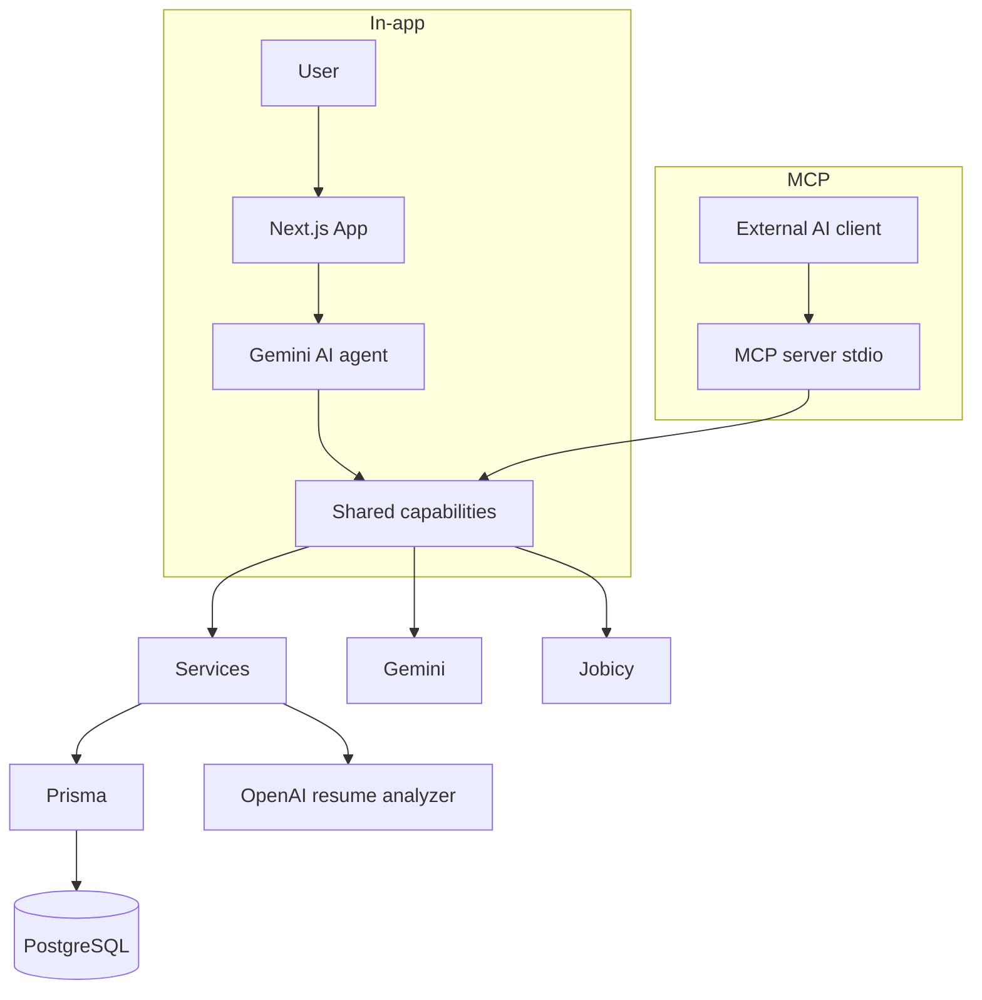

# JobTracker AI


**Live demo:** [https://jobtracker-ai-tau.vercel.app](https://jobtracker-ai-tau.vercel.app)  
**GitHub:** [ahmedmustaf103-dot/jobtracker-ai](https://github.com/ahmedmustaf103-dot/jobtracker-ai)  
**Case study:** [docs/case-study.md](./docs/case-study.md)

JobTracker AI is a full-stack AI-powered job application platform that combines application tracking, AI-assisted cover letters, resume analysis, job search, an AI agent with tool calling, MCP integration, AI job matching, and automated evaluations.

| Try the demo | |
|---|---|
| **Demo login** | `demo@jobtracker.ai` / `password123` |
| **Or** | [Create a free account](https://jobtracker-ai-tau.vercel.app/register) |

---

## Problem

Job searching usually means a spreadsheet for applications, a separate doc for cover letters, and another tab for resume tweaks. Progress is hard to see, and AI tools are scattered — useful drafts, but nothing wired into the actual pipeline.

## Solution

One signed-in workspace to track roles from wishlist to offer, with AI that helps where it saves time:

- Draft cover letters from a job description
- Analyze a resume for ATS-oriented feedback
- Ask an assistant to search remote jobs and update your tracker
- Score resume ↔ job-description fit on an application
- Reuse the same business logic from a local MCP server

Build arc (visible in Git history):

`Core product → AI agent → MCP → Evals → Job Match → Production hardening`

---

## Main features

- **Auth** — email/password sign-up and sign-in (Auth.js v5, JWT sessions)
- **Applications CRUD** — company, role, location, salary, URL, notes
- **Status pipeline** — wishlist → applied → screening → interview → offer (inline updates)
- **Filters & dashboard** — status filters, totals, pipeline breakdown, recent activity
- **Settings** — display name and password
- **AI cover letters** — Gemini-generated drafts, saved to the account
- **AI resume analyzer** — PDF/DOCX upload with ATS-oriented scoring (OpenAI)
- **AI Job Search Assistant** — Gemini tool-calling agent
- **MCP server** — stdio tools over shared capabilities
- **Evals** — deterministic regression checks + live MCP smoke
- **AI Job Match** — on-demand resume ↔ JD score on application detail pages

---

## AI capabilities

| Capability | Provider | Notes |
|------------|----------|--------|
| Cover letters | Google Gemini | Generate + save; rate-limited; safe client errors |
| Resume analyzer | OpenAI | Local/dev + production (Blob storage on Vercel) |
| Job search (agent/MCP) | Jobicy (+ Remotive fallback) | Remote openings |
| Job Match | Gemini JSON → Zod | Score 0–100; gaps phrased as “not mentioned in resume” |
| In-app agent | Gemini function calling | Tools mutate **your** applications only |

---

## AI agent + tool calling

The in-app assistant (`/assistant`) uses Gemini function calling with five tools:

| Tool | Purpose |
|------|---------|
| `search_remote_jobs` | Find remote openings |
| `get_pipeline_stats` | Totals by status |
| `search_applications` | Search the signed-in user’s applications |
| `save_application` | Create a tracked application |
| `update_application_status` | Update status with ownership checks |

Tools route through **shared capability handlers** — the same layer used by MCP.

---

## MCP server

A local **stdio** MCP server exposes JobTracker capabilities to hosts such as Cursor or MCP Inspector. It does **not** replace the in-app agent; it reuses the same handlers and Prisma services.

| MCP tool | What it does |
|----------|----------------|
| `search_jobs` | Search remote openings |
| `get_application_details` | Application + timeline (ownership-scoped) |
| `get_applications` | List/search applications |
| `generate_cover_letter` | Generate with Gemini and save |
| `update_application` | Full field update (ownership-checked) |
| `save_application` | Create an application |
| `get_pipeline_stats` | Pipeline totals |

Identity comes only from local env (`MCP_USER_EMAIL` or `MCP_USER_ID`) — never from tool arguments. Intended for a **trusted local host**.

Full design: [docs/mcp-architecture.md](./docs/mcp-architecture.md)

---

## Evals and reliability

Deterministic evals cover tool routing, ownership, invalid input, job-search relevance, cover-letter generate+save, Job Match validation, and MCP response formatting. Capability errors are sanitized so secrets and connection strings never reach clients.

Details: [docs/evals.md](./docs/evals.md) · [evals/README.md](./evals/README.md)

---

## AI Job Match

On an application detail page, compare your latest uploaded resume to a job description:

- Score **0–100%** with recommendation band (strong / good / partial / weak)
- Matching skills, gaps, experience notes, strengths, summary
- Gemini JSON validated with **Zod**; recommendation derived from the score
- Scores are **not** persisted (recomputed on demand)
- Not exposed as an MCP/agent tool (by design)

Details: [docs/job-match.md](./docs/job-match.md)

---

## Verified results

Latest local verification (portfolio polish pass):

| Check | Command | Result |
|-------|---------|--------|
| Unit + eval suite | `npm test` | **119/119** |
| Deterministic evals | `npm run eval` | **31/31** |
| MCP live smoke | `npm run verify:mcp` | **19/19** |
| Production E2E | `npm run test:e2e` | **5/5** |
| Production build | `npm run build` | **Passing** |

CI also runs tests + build on every push to `main`, and Playwright smoke against the live demo.

---

## Architecture

MCP and the in-app Gemini agent **reuse the same business logic** via shared capability handlers. No duplicated Prisma or AI orchestration for those tools.

### In-app path

```text
User
  ↓
Next.js application (UI + Auth.js)
  ↓
AI agent (Gemini tool calling)
  ↓
Tools / shared capabilities
  ↓
Services
  ↓
Prisma
  ↓
PostgreSQL (Neon in production)
```

### MCP path

```text
External AI client (Cursor / MCP Inspector)
  ↓
MCP server (stdio)
  ↓
Shared capabilities
  ↓
Existing services → Prisma → PostgreSQL
```



| Concern | Approach |
|---------|----------|
| Auth | Auth.js v5, JWT sessions, middleware-protected routes |
| Data | Prisma 6 + PostgreSQL; migrations on Vercel build |
| AI | Gemini (+ OpenAI for resume); Zod validation where structured |
| Rate limits | In-memory per-user limits on AI and upload actions |
| Resume files | Local disk in dev; **Vercel Blob** in production |
| Errors | Sanitized capability / Gemini messages — no secrets in clients |

---

## Tech stack

| Area | Technology |
|------|------------|
| Framework | Next.js 15 (App Router, Server Actions), React 19 |
| Language | TypeScript |
| Runtime | Node.js |
| Styling | Tailwind CSS v4 |
| Database | PostgreSQL (Neon in production) |
| ORM | Prisma 6 |
| Auth | Auth.js (next-auth v5) |
| Validation | Zod |
| AI | Google Gemini 2.5 Flash, OpenAI |
| Protocol | Model Context Protocol (MCP, stdio) |
| Hosting / CI | Vercel, GitHub Actions |

---

## Documentation

| Doc | Contents |
|-----|----------|
| [docs/case-study.md](./docs/case-study.md) | Portfolio write-up, LinkedIn/CV copy |
| [docs/mcp-architecture.md](./docs/mcp-architecture.md) | MCP design, tools, security |
| [docs/evals.md](./docs/evals.md) | Eval suite and sanitized errors |
| [docs/job-match.md](./docs/job-match.md) | Scoring model and limitations |

---

## Screenshots & demo

### Included


### Demo video

<video src="./docs/videos/demo-walkthrough.webm" controls width="100%">
  Demo walkthrough — login, applications, timeline, cover letters
</video>

Re-capture: `npm run screenshots` · Re-record: `npm run record:demo`

### Recommended additions (add manually — not generated)

These are **not** in the repo yet. Capture from the live demo or local app and drop into `docs/screenshots/`:

| Suggested file | What to capture |
|----------------|-----------------|
| `assistant.png` | AI Assistant chat with a tool call / job results |
| `job-match.png` | Application detail — AI Job Match panel (score or empty/input state) |
| `mcp-inspector.png` | MCP Inspector connected to `npm run mcp` |
| `evals.png` | Terminal output of `npm run eval` (31/31) |

See [docs/screenshots/README.md](./docs/screenshots/README.md).

---

## Project structure

```
src/
├── app/                 # Marketing, auth, dashboard routes + API
├── components/          # UI, applications, cover letters, resume analyzer
├── lib/
│   ├── agent/           # Gemini job-search agent
│   ├── capabilities/    # Shared handlers (agent + MCP)
│   ├── job-match/       # Job Match generation + JD resolution
│   └── …                # db, auth, gemini, openai, rate-limit
├── server/actions/      # Server Actions
├── server/services/     # Prisma / business logic
└── validations/         # Zod schemas
mcp/src/server.ts        # MCP stdio entrypoint
evals/                   # Deterministic eval suite
docs/                    # Architecture + portfolio docs
prisma/                  # Schema + migrations
```

---

## Getting started

```bash
npm install
cp .env.example .env
# Fill DATABASE_URL, AUTH_SECRET, AUTH_URL, GEMINI_API_KEY
# (OPENAI_API_KEY for resume analyzer; MCP_USER_EMAIL for MCP)
npm run db:migrate
npm run db:seed          # optional — demo@jobtracker.ai / password123
npm run dev
```

Open [http://localhost:3000](http://localhost:3000).

Prefer putting the real Neon URL in `.env.local` (overrides `.env`). `npm run build` loads `.env` then `.env.local` so a stale local `DATABASE_URL` does not break production builds.

### Environment variables

Copy from [`.env.example`](./.env.example). Placeholders only — never commit real secrets.

| Variable | Required | Description |
|----------|----------|-------------|
| `DATABASE_URL` | Yes | PostgreSQL connection string |
| `AUTH_SECRET` | Yes | `openssl rand -base64 32` |
| `AUTH_URL` | Yes | App URL (`http://localhost:3000` locally) |
| `GEMINI_API_KEY` | Cover letters / agent / Job Match | Google AI Studio key (`AQ.…` or `AIzaSy…`) |
| `GEMINI_MODEL` | No | Defaults to `gemini-2.5-flash` |
| `OPENAI_API_KEY` | Resume analyzer | OpenAI API key |
| `OPENAI_MODEL` | No | Defaults to `gpt-4o-mini` |
| `NEXT_PUBLIC_APP_URL` | No | Public URL for metadata |
| `NEXT_PUBLIC_RESUME_ANALYZER_ENABLED` | No | `"true"` to enable uploads in production |
| `BLOB_READ_WRITE_TOKEN` | Prod resumes | Injected by Vercel Blob |
| `MCP_USER_EMAIL` | MCP | Local user the MCP process acts as |
| `MCP_USER_ID` | MCP | Alternative to `MCP_USER_EMAIL` |

### MCP setup

```bash
# .env / .env.local
MCP_USER_EMAIL=demo@jobtracker.ai

npm run mcp              # stdio server
npm run mcp:inspect      # MCP Inspector UI
npm run verify:mcp       # automated 19 checks
```

Example Cursor / Claude Desktop config:

```json
{
  "mcpServers": {
    "jobtracker-ai": {
      "command": "npm",
      "args": ["run", "mcp"],
      "cwd": "/absolute/path/to/jobtracker-ai",
      "env": {
        "MCP_USER_EMAIL": "demo@jobtracker.ai"
      }
    }
  }
}
```

### Useful commands

```bash
npm test                 # 119 unit + eval tests
npm run eval             # 31 deterministic evals
npm run verify:mcp       # 19 MCP checks
npm run build            # production build
npm run test:e2e         # 5 Playwright smokes (live demo by default)
```

---

## Deployment

**Production:** [https://jobtracker-ai-tau.vercel.app](https://jobtracker-ai-tau.vercel.app)

Hosted on **Vercel** with **Neon** PostgreSQL. Build runs `prisma generate`, `prisma migrate deploy`, and `next build` (via `scripts/run-build.mjs`).

Resume files in production use [Vercel Blob](https://vercel.com/docs/storage/vercel-blob). See `npm run vercel:setup-blob` for setup steps.

---

## CV / LinkedIn (copy-paste)

- **JobTracker AI** — Full-stack AI job application platform: Auth.js + Prisma pipeline, Gemini cover letters & tool-calling agent, shared MCP capabilities, deterministic evals, and Zod-validated resume↔JD match scores. Next.js 15, TypeScript, PostgreSQL/Neon, Vercel. [Demo](https://jobtracker-ai-tau.vercel.app) · [GitHub](https://github.com/ahmedmustaf103-dot/jobtracker-ai)

Shorter:

- **JobTracker AI** — Next.js SaaS for tracking applications, with an AI agent, MCP server, evals, and job-match scoring. [Demo](https://jobtracker-ai-tau.vercel.app) · [Code](https://github.com/ahmedmustaf103-dot/jobtracker-ai)

---

## License

MIT
