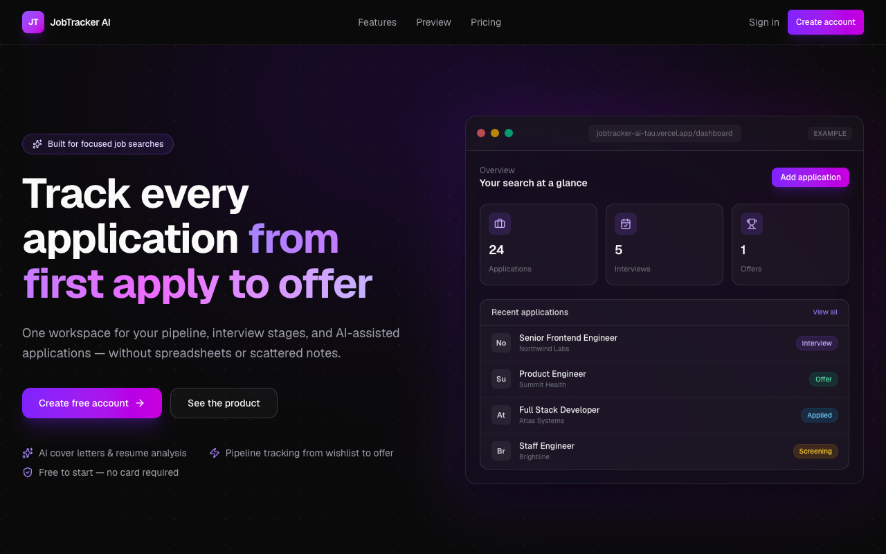
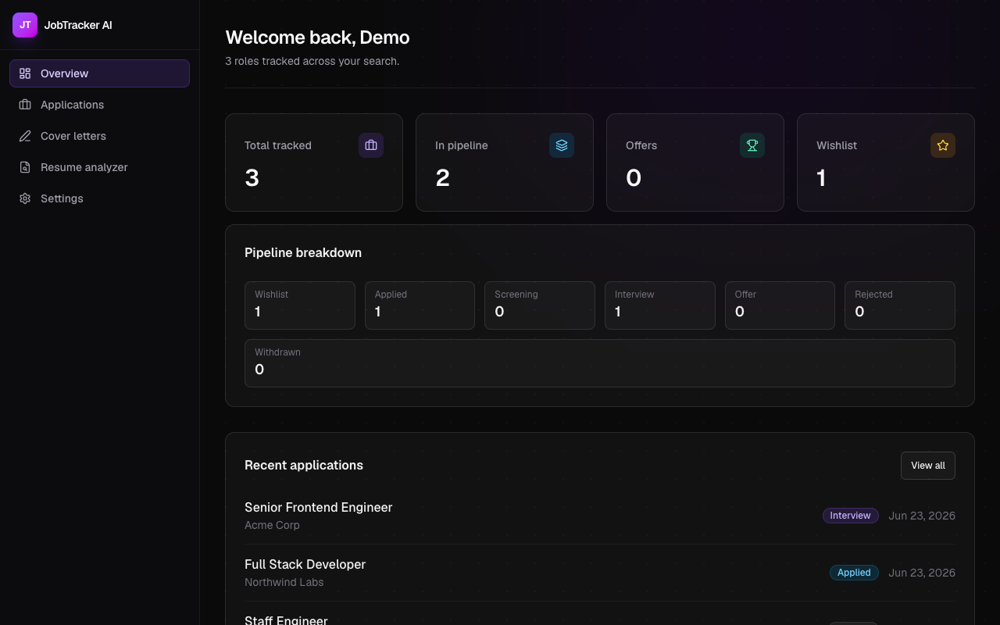
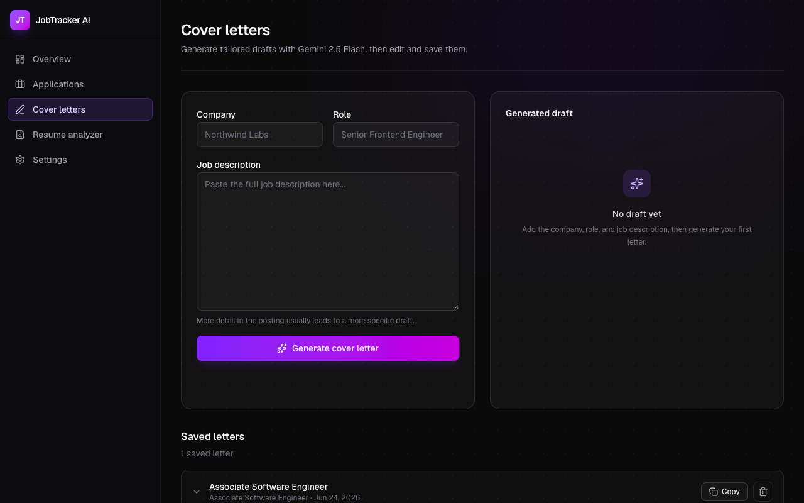
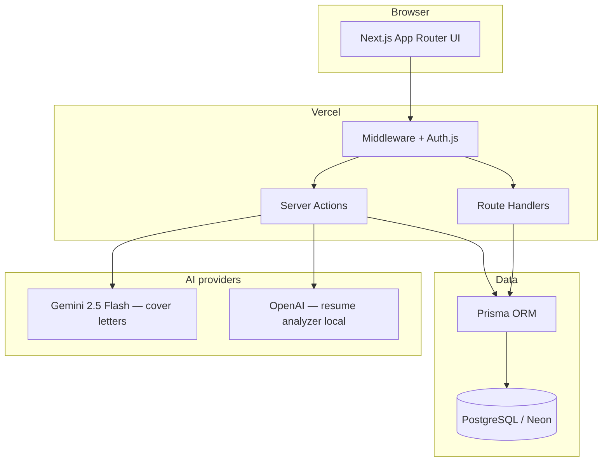

# JobTracker AI


**Live demo:** [https://jobtracker-ai-tau.vercel.app](https://jobtracker-ai-tau.vercel.app) · **GitHub:** [ahmedmustaf103-dot/jobtracker-ai](https://github.com/ahmedmustaf103-dot/jobtracker-ai)

> **CV one-liner:** JobTracker AI — full-stack job search SaaS (Next.js, Prisma, Auth.js, Gemini). [Live demo](https://jobtracker-ai-tau.vercel.app) + [GitHub](https://github.com/ahmedmustaf103-dot/jobtracker-ai).

SaaS for tracking job applications — with AI cover letters and resume analysis.

Track every role from wishlist to offer: status pipeline, quick updates, filters, a stats dashboard, and AI tools to sharpen your applications.

### Try it now

| | |
|---|---|
| **Demo login** | `demo@jobtracker.ai` / `password123` |
| **Or** | [Create a free account](https://jobtracker-ai-tau.vercel.app/register) |

> **Live demo:** Application tracking, dashboard, and AI cover letters work in production. Resume upload is disabled on Vercel (serverless has no persistent disk) — run locally to try the full analyzer.

## Why I built this

I built JobTracker AI to solve a problem I kept hitting during job searches: tracking roles in spreadsheets while juggling cover letters and interview prep in separate tabs. I wanted one place to manage the pipeline, see progress at a glance, and use AI where it actually saves time — drafting a first cover letter from a job description, not replacing thoughtful edits.

The project let me practice a full SaaS stack end-to-end: Auth.js sessions, Prisma on PostgreSQL, Server Actions, rate limiting, and integrating two AI providers (Gemini for cover letters, OpenAI for resume scoring). Production deployment on Vercel + Neon surfaced real constraints — like disabling resume uploads until cloud storage is wired up — which made the demo honest and the architecture decisions clearer.

## Screenshots







Re-capture after UI changes: `npm run screenshots` (uses the live demo by default).

## Architecture



| Concern | Approach |
|---------|----------|
| Auth | Auth.js v5, JWT sessions, protected routes via middleware |
| Data | Prisma 6 + PostgreSQL; migrations run on Vercel build |
| AI | Gemini with retry/fallback models; generic errors to clients |
| Rate limits | In-memory per-user limits on AI and upload actions |
| Resume files | Local disk in dev; feature-flagged off in production |

## Features

- **Auth** — email/password sign up & sign in (Auth.js v5, JWT sessions)
- **Applications CRUD** — create, edit, delete roles with company, salary, notes
- **Status workflow** — wishlist → applied → screening → interview → offer, with quick inline updates
- **Filters** — filter the list by any status via URL params
- **Dashboard** — totals, pipeline breakdown, recent activity, onboarding for new users
- **Settings** — update display name, change password
- **AI cover letters** — generate tailored cover letters with **Gemini 2.5 Flash** (Google AI Studio free tier)
- **AI resume analyzer** — upload PDF/DOCX for ATS score, strengths, weaknesses, and keyword tips (OpenAI)

## Stack

| Layer | Technology |
|--------|------------|
| Framework | Next.js 15 (App Router, Server Actions) |
| Language | TypeScript |
| Styling | Tailwind CSS v4 |
| Database | PostgreSQL |
| ORM | Prisma 6 |
| Auth | Auth.js (next-auth v5) |
| Validation | Zod |
| AI (cover letters) | Google Gemini 2.5 Flash |
| AI (resume) | OpenAI API |

## Project structure

```
src/
├── app/
│   ├── (marketing)/     # Public landing page
│   ├── (auth)/          # Login & register
│   ├── (dashboard)/     # Protected app (dashboard, applications, AI tools)
│   └── api/             # Route handlers (e.g. POST /api/cover-letters/generate)
├── components/
│   ├── ui/              # Buttons, inputs, cards, confirm dialog
│   ├── layout/          # Headers, sidebar, mobile shell
│   ├── marketing/       # Landing page sections
│   ├── cover-letters/   # Cover letter generator UI
│   └── resume-analyzer/ # Resume upload & analysis UI
├── lib/                 # Shared utilities (db, auth, gemini, openai, rate-limit)
├── server/
│   ├── actions/         # Server Actions
│   └── services/        # Data / business logic
├── types/               # Shared TypeScript types
└── validations/         # Zod schemas
prisma/
├── schema.prisma        # Database models
└── migrations/          # SQL migrations
```

## Getting started

```bash
npm install
cp .env.example .env
# Set DATABASE_URL, AUTH_SECRET, AUTH_URL, GEMINI_API_KEY (and OPENAI_API_KEY for resume analyzer) in .env
npm run db:migrate
npm run dev
```

Open [http://localhost:3000](http://localhost:3000).

### Environment variables

| Variable | Required | Description |
|----------|----------|-------------|
| `DATABASE_URL` | Yes | PostgreSQL connection string (Neon, Supabase, or local) |
| `AUTH_SECRET` | Yes | Session secret — generate with `openssl rand -base64 32` |
| `AUTH_URL` | Yes | App URL (`http://localhost:3000` locally) |
| `GEMINI_API_KEY` | Cover letters | **Google AI Studio** key from [aistudio.google.com/apikey](https://aistudio.google.com/apikey) — must start with `AIzaSy` (not Vertex or other formats) |
| `GEMINI_MODEL` | No | Gemini model override (defaults to `gemini-2.5-flash`) |
| `OPENAI_API_KEY` | Resume analyzer | OpenAI API key for resume analysis |
| `OPENAI_MODEL` | No | OpenAI model override (defaults to `gpt-4o-mini`) |
| `NEXT_PUBLIC_APP_URL` | No | Public URL used in site metadata |
| `NEXT_PUBLIC_RESUME_ANALYZER_ENABLED` | No | Set `"true"` to enable resume upload in production (needs cloud storage) |

### Cover letter API

Authenticated users can also generate via HTTP:

```bash
POST /api/cover-letters/generate
Content-Type: application/json

{
  "company": "Northwind Labs",
  "role": "Senior Frontend Engineer",
  "jobDescription": "Paste the full job description here..."
}
```

Returns `{ "content": "..." }` or `{ "error": "..." }`. Requires a signed-in session cookie.

### Demo account

After `npm run db:seed`: **demo@jobtracker.ai** / **password123** (3 sample applications).

### Database commands

| Command | Description |
|---------|-------------|
| `npm run db:migrate` | Apply migrations (development) |
| `npm run db:migrate:deploy` | Apply migrations (production) |
| `npm run db:push` | Push schema without migration files |
| `npm run db:studio` | Open Prisma Studio |
| `npm run db:seed` | Seed demo user + sample applications |

### Tests

```bash
npm test
```

Unit tests cover validation schemas, AI error mappers, Gemini retry logic, and the in-memory rate limiter. CI runs `npm test` and `npm run build` on every push to `main`.

## Deployment (Vercel)

**Production:** [https://jobtracker-ai-tau.vercel.app](https://jobtracker-ai-tau.vercel.app)

Hosted on Vercel with Neon PostgreSQL. Migrations run automatically during build (`prisma migrate deploy`).

To redeploy after pushing to GitHub:

```bash
git push origin main   # if Git integration is connected
# or
npx vercel deploy --prod
```

### Manual setup (first time)

1. Push the repo to GitHub and import it in [Vercel](https://vercel.com/new).
2. Provision PostgreSQL (e.g. [Neon](https://neon.tech)) and copy the **pooled** connection string.
3. Set environment variables in Vercel:
   - `DATABASE_URL` — Neon pooled Postgres URL
   - `AUTH_SECRET` — `openssl rand -base64 32`
   - `AUTH_URL` — your production URL (e.g. `https://jobtracker-ai-tau.vercel.app`)
   - `NEXT_PUBLIC_APP_URL` — same as `AUTH_URL`
   - `GEMINI_API_KEY` — from [Google AI Studio](https://aistudio.google.com/apikey); must start with **`AIzaSy`**. Keys in other formats (e.g. Vertex `AQ.xxx`) will fail cover letter generation.
   - `OPENAI_API_KEY` — for resume analyzer (optional if you disable that feature)
4. Deploy. Build runs `prisma generate`, `prisma migrate deploy`, and `next build`.
5. Seed the demo account (optional):

```bash
DATABASE_URL="<production-url>" npm run db:seed
```

### Resume uploads on Vercel

The resume analyzer stores uploaded files on the local filesystem (`storage/uploads/resumes/`). This works locally but **does not persist on Vercel's serverless runtime**. The app disables resume upload in production builds by default (`NEXT_PUBLIC_RESUME_ANALYZER_ENABLED` is only needed to turn it back on after adding cloud storage such as S3 or Vercel Blob). Cover letters and the rest of the app work fine in production.

## License

MIT
