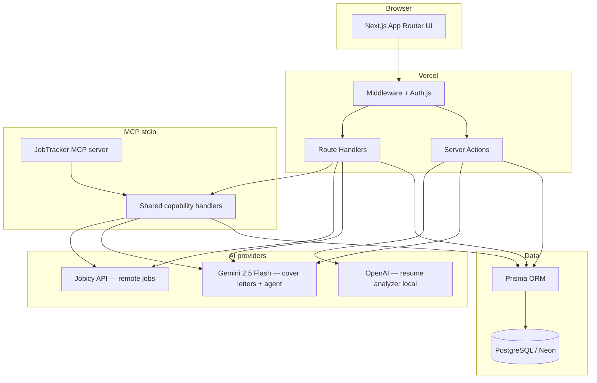

# JobTracker AI


**Live demo:** [https://jobtracker-ai-tau.vercel.app](https://jobtracker-ai-tau.vercel.app) · **GitHub:** [ahmedmustaf103-dot/jobtracker-ai](https://github.com/ahmedmustaf103-dot/jobtracker-ai)

> **CV one-liner:** JobTracker AI — full-stack job search SaaS (Next.js, Prisma, Auth.js, Gemini). [Live demo](https://jobtracker-ai-tau.vercel.app) + [GitHub](https://github.com/ahmedmustaf103-dot/jobtracker-ai).

### CV bullet (copy-paste)

Use this on your CV, LinkedIn, or cover letter:

- **JobTracker AI** — Full-stack job search SaaS with auth, application pipeline, dashboard analytics, and AI cover letters (Gemini). Built with Next.js 15, TypeScript, Prisma, PostgreSQL, and Auth.js. [Live demo](https://jobtracker-ai-tau.vercel.app) · [GitHub](https://github.com/ahmedmustaf103-dot/jobtracker-ai)

Shorter version:

- **JobTracker AI** — Next.js SaaS for tracking job applications and generating AI cover letters. [Demo](https://jobtracker-ai-tau.vercel.app) · [Code](https://github.com/ahmedmustaf103-dot/jobtracker-ai)

SaaS for tracking job applications — with AI cover letters and resume analysis.

Track every role from wishlist to offer: status pipeline, quick updates, filters, a stats dashboard, and AI tools to sharpen your applications.

### Try it now

| | |
|---|---|
| **Demo login** | `demo@jobtracker.ai` / `password123` |
| **Or** | [Create a free account](https://jobtracker-ai-tau.vercel.app/register) |

> **Live demo:** Application tracking, application detail timelines, AI cover letters, and resume upload (with Vercel Blob) work in production.

## Demo walkthrough (~60s)

<video src="./docs/videos/demo-walkthrough.webm" controls width="100%">
  Demo walkthrough — login, applications, timeline, cover letters
</video>

Re-record after UI changes: `npm run record:demo`

## Why I built this

I built JobTracker AI to solve a problem I kept hitting during job searches: tracking roles in spreadsheets while juggling cover letters and interview prep in separate tabs. I wanted one place to manage the pipeline, see progress at a glance, and use AI where it actually saves time — drafting a first cover letter from a job description, not replacing thoughtful edits.

The project let me practice a full SaaS stack end-to-end: Auth.js sessions, Prisma on PostgreSQL, Server Actions, rate limiting, and integrating two AI providers (Gemini for cover letters, OpenAI for resume scoring). Production deployment on Vercel + Neon surfaced real constraints — like wiring resume uploads through Vercel Blob instead of local disk — which made the demo honest and the architecture decisions clearer.

## Screenshots


Re-capture after UI changes: `npm run screenshots` (uses the live demo by default).

## Architecture



| Concern | Approach |
|---------|----------|
| Auth | Auth.js v5, JWT sessions, protected routes via middleware |
| Data | Prisma 6 + PostgreSQL; migrations run on Vercel build |
| AI | Gemini with retry/fallback models; generic errors to clients |
| Rate limits | In-memory per-user limits on AI and upload actions |
| Resume files | Local disk in dev; **Vercel Blob** in production |

## Features

- **Auth** — email/password sign up & sign in (Auth.js v5, JWT sessions)
- **Applications CRUD** — create, edit, delete roles with company, salary, notes
- **Status workflow** — wishlist → applied → screening → interview → offer, with quick inline updates
- **Filters** — filter the list by any status via URL params
- **Dashboard** — totals, pipeline breakdown, recent activity, onboarding for new users
- **Settings** — update display name, change password
- **AI cover letters** — generate tailored cover letters with **Gemini 2.5 Flash** (Google AI Studio free tier)
- **AI Job Search Assistant** — Gemini agent with 5 tools (remote job search, pipeline stats, application search/save/status updates)
- **MCP server** — stdio MCP tools reusing the same capabilities (jobs, applications, cover letters)
- **Evals** — automated capability/agent/MCP checks (`npm run eval`) plus live MCP smoke
- **AI Job Match** — on-demand resume ↔ job description score on application detail pages
- **AI resume analyzer** — upload PDF/DOCX for ATS score, strengths, weaknesses, and keyword tips (OpenAI)

## Stack

| Layer | Technology |
|--------|------------|
| Framework | Next.js 15 (App Router, Server Actions) |
| Language | TypeScript |
| Styling | Tailwind CSS v4 |
| Database | PostgreSQL |
| ORM | Prisma 6 |
| Auth | Auth.js (next-auth v5) |
| Validation | Zod |
| AI (cover letters) | Google Gemini 2.5 Flash |
| AI (resume) | OpenAI API |
| MCP | `@modelcontextprotocol/server` (stdio) |

## Project structure

```
src/
├── app/
│   ├── (marketing)/     # Public landing page
│   ├── (auth)/          # Login & register
│   ├── (dashboard)/     # Protected app (dashboard, applications, AI tools)
│   └── api/             # Route handlers (e.g. POST /api/cover-letters/generate)
├── components/
│   ├── ui/              # Buttons, inputs, cards, confirm dialog
│   ├── layout/          # Headers, sidebar, mobile shell
│   ├── marketing/       # Landing page sections
│   ├── cover-letters/   # Cover letter generator UI
│   └── resume-analyzer/ # Resume upload & analysis UI
├── lib/
│   ├── agent/           # Gemini job-search agent (Phase 2)
│   ├── capabilities/    # Shared handlers used by agent + MCP
│   └── …                # db, auth, gemini, openai, rate-limit
├── server/
│   ├── actions/         # Server Actions
│   └── services/        # Data / business logic
├── types/               # Shared TypeScript types
└── validations/         # Zod schemas
mcp/
└── src/server.ts        # MCP stdio entrypoint (Phase 3)
prisma/
├── schema.prisma        # Database models
└── migrations/          # SQL migrations
docs/
└── mcp-architecture.md  # MCP architecture notes
```

## MCP server (Phase 3)

The MCP server exposes JobTracker capabilities to local MCP hosts over **stdio**. It reuses the same Prisma services and job/cover-letter logic as the app — it does **not** replace the Gemini assistant UI.

See [docs/mcp-architecture.md](./docs/mcp-architecture.md) for the full diagram.

### Available tools

| Tool | What it does |
|------|----------------|
| `search_jobs` | Search remote openings (Jobicy + Remotive fallback) |
| `get_application_details` | Load a tracked application + timeline (ownership-scoped) |
| `get_applications` | List/search the configured user's applications |
| `generate_cover_letter` | Generate with Gemini and **save** (same as UI) |
| `update_application` | Full field update with optional status (ownership-checked) |
| `save_application` | Create a tracked application |
| `get_pipeline_stats` | Totals by status + recent applications |

### Run locally

```bash
# In .env / .env.local — pick one identity for the local MCP process
MCP_USER_EMAIL=demo@jobtracker.ai
# or MCP_USER_ID=<cuid>

npm run mcp              # stdio server (for MCP hosts)
npm run mcp:inspect      # open MCP Inspector
npm run verify:mcp       # automated connect + tool checks
```

Example Cursor / Claude Desktop config:

```json
{
  "mcpServers": {
    "jobtracker-ai": {
      "command": "npm",
      "args": ["run", "mcp"],
      "cwd": "/absolute/path/to/jobtracker-ai",
      "env": {
        "MCP_USER_EMAIL": "demo@jobtracker.ai"
      }
    }
  }
}
```

### MCP security

- Identity is **only** `MCP_USER_ID` or `MCP_USER_EMAIL` on the local process — not caller-supplied user ids.
- All DB tools use existing `userId`-scoped services; other users’ rows are not returned or updated.
- Tool responses never include env vars or API keys.
- Intended for a **trusted local host**. Shared remote MCP auth is out of scope for Phase 3.

## Evals & error handling (Phase 4)

Automated checks for tool routing, ownership, invalid input, job-search relevance, cover-letter generate+save, and MCP response formatting.

```bash
npm run eval        # deterministic eval suite
npm run eval:mcp    # live MCP smoke (alias of verify:mcp)
npm test            # full unit + eval suite
```

Details: [docs/evals.md](./docs/evals.md) · [evals/README.md](./evals/README.md)

Capability failures are sanitized so secrets/connection strings never appear in tool or agent error payloads.

## AI Job Match

On application detail pages, compare your latest resume to a job description for a 0–100% match score, skills overlap, gaps, and a recommendation.

See [docs/job-match.md](./docs/job-match.md) for the scoring model and limitations.

## Getting started

```bash
npm install
cp .env.example .env
# Set DATABASE_URL, AUTH_SECRET, AUTH_URL, GEMINI_API_KEY (and OPENAI_API_KEY for resume analyzer) in .env
npm run db:migrate
npm run dev
```

Open [http://localhost:3000](http://localhost:3000).

### Environment variables

| Variable | Required | Description |
|----------|----------|-------------|
| `DATABASE_URL` | Yes | PostgreSQL connection string (Neon, Supabase, or local) |
| `AUTH_SECRET` | Yes | Session secret — generate with `openssl rand -base64 32` |
| `AUTH_URL` | Yes | App URL (`http://localhost:3000` locally) |
| `GEMINI_API_KEY` | Cover letters | **Google AI Studio** key from [aistudio.google.com/apikey](https://aistudio.google.com/apikey) — `AQ.…` (new) or `AIzaSy…` (legacy) |
| `GEMINI_MODEL` | No | Gemini model override (defaults to `gemini-2.5-flash`) |
| `OPENAI_API_KEY` | Resume analyzer | OpenAI API key for resume analysis |
| `OPENAI_MODEL` | No | OpenAI model override (defaults to `gpt-4o-mini`) |
| `NEXT_PUBLIC_APP_URL` | No | Public URL used in site metadata |
| `NEXT_PUBLIC_RESUME_ANALYZER_ENABLED` | No | Set `"true"` to enable resume upload in production (needs cloud storage) |
| `MCP_USER_EMAIL` | MCP | Email of the local user the MCP server acts as (alternative to `MCP_USER_ID`) |
| `MCP_USER_ID` | MCP | User id the local MCP server acts as (alternative to `MCP_USER_EMAIL`) |

### Cover letter API

Authenticated users can also generate via HTTP:

```bash
POST /api/cover-letters/generate
Content-Type: application/json

{
  "company": "Northwind Labs",
  "role": "Senior Frontend Engineer",
  "jobDescription": "Paste the full job description here..."
}
```

Returns `{ "content": "..." }` or `{ "error": "..." }`. Requires a signed-in session cookie.

### Demo account

After `npm run db:seed`: **demo@jobtracker.ai** / **password123** (3 sample applications).

### Database commands

| Command | Description |
|---------|-------------|
| `npm run db:migrate` | Apply migrations (development) |
| `npm run db:migrate:deploy` | Apply migrations (production) |
| `npm run db:push` | Push schema without migration files |
| `npm run db:studio` | Open Prisma Studio |
| `npm run db:seed` | Seed demo user + sample applications |

### Tests

```bash
npm test
```

Unit tests cover validation schemas, AI error mappers, Gemini retry logic, and the in-memory rate limiter. CI runs unit tests, production build, and Playwright smoke tests against the live demo.

```bash
npm test          # unit tests
npm run test:e2e  # smoke tests (live demo by default)
```

### Fix Gemini on production

Cover letters need a **Google AI Studio** key. New keys start with **`AQ.`** (auth keys); older keys start with **`AIzaSy`**. Both work.

1. Create a key at [aistudio.google.com/apikey](https://aistudio.google.com/apikey)
2. Set `GEMINI_API_KEY=AQ.…` (or `AIzaSy…`) in `.env`
3. Verify locally:

```bash
npm run verify:gemini
```

4. Sync to Vercel (requires `npx vercel login` first):

```bash
npm run vercel:sync-gemini
npx vercel deploy --prod
```

5. Confirm: `curl https://jobtracker-ai-tau.vercel.app/api/health` should show `"formatValid": true`

## Deployment (Vercel)

**Production:** [https://jobtracker-ai-tau.vercel.app](https://jobtracker-ai-tau.vercel.app)

Hosted on Vercel with Neon PostgreSQL. Migrations run automatically during build (`prisma migrate deploy`).

To redeploy after pushing to GitHub:

```bash
git push origin main   # if Git integration is connected
# or
npx vercel deploy --prod
```

### Manual setup (first time)

1. Push the repo to GitHub and import it in [Vercel](https://vercel.com/new).
2. Provision PostgreSQL (e.g. [Neon](https://neon.tech)) and copy the **pooled** connection string.
3. Set environment variables in Vercel:
   - `DATABASE_URL` — Neon pooled Postgres URL
   - `AUTH_SECRET` — `openssl rand -base64 32`
   - `AUTH_URL` — your production URL (e.g. `https://jobtracker-ai-tau.vercel.app`)
   - `NEXT_PUBLIC_APP_URL` — same as `AUTH_URL`
   - `GEMINI_API_KEY` — from [Google AI Studio](https://aistudio.google.com/apikey); new keys use **`AQ.`** format, legacy keys use **`AIzaSy`**
   - `OPENAI_API_KEY` — for resume analyzer (optional if you disable that feature)
4. Deploy. Build runs `prisma generate`, `prisma migrate deploy`, and `next build`.
5. Seed the demo account (optional):

```bash
DATABASE_URL="<production-url>" npm run db:seed
```

### Resume uploads (Vercel Blob)

Production resume files use [**Vercel Blob**](https://vercel.com/docs/storage/vercel-blob). Local development uses `storage/uploads/resumes/`.

**Setup:**

```bash
npm run vercel:setup-blob   # prints steps
```

1. Create a Blob store in the [Vercel project Storage tab](https://vercel.com) and link it to this app
2. Redeploy — Vercel injects `BLOB_READ_WRITE_TOKEN` automatically
3. Confirm: `curl https://jobtracker-ai-tau.vercel.app/api/health` → `"storage": "blob"`

Resume **analysis** still requires `OPENAI_API_KEY` with available quota.

## License

MIT
